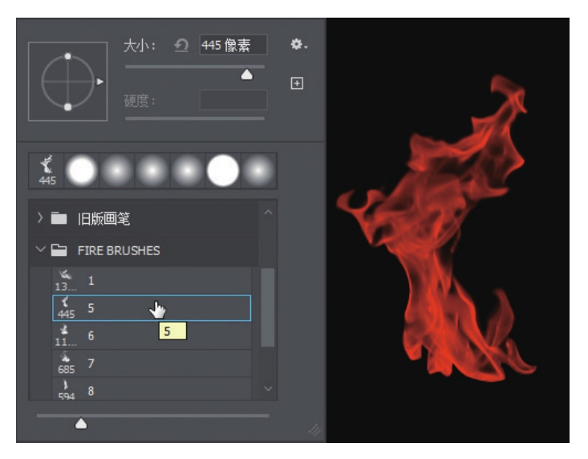
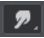

- 分辨率单位：PPI (Pixel Per Inch)

  72Ppi 即表示 1 英寸由 72 个像素点组成

  > 常用分辨率：
  > - 洗印照片：300像素／英寸或以上。
  > - 杂志名片等印刷物：300像素／英寸。
  > - 大型海报：96～200像素／英寸。
  > - 电子图像：72像素／英寸或96像素／英寸。
  > - 大型喷绘、户外广告：25～50像素／英寸。

- CMYK 是印刷颜色模式，由青色、品红、黄色和黑色油墨进行混合，从而表现出各种印刷颜色

  > 在新建文档的时候，要根据文件的用途来选择相应的颜色模式，如果要做纯电子图片，即用于网页、应用、网络图片、视频素材、3D贴图等，就选择【RGB颜色】；如果要做宣传册、书籍、海报、单页、喷绘等印刷类的图像，就选择【CMYK颜色】。

- 移动图层：Ctrl+[	Ctrl+]	Ctrl+Shift+]	Ctrl+Shift+[

- 复制图层：按住Alt+拖动	Ctrl+J(本质是新建)

- 选区绘制：

  1. 矩形选框选取
  2. 正方形：Shift+鼠标左键拖动
  3. 以单击处为中心扩展：鼠标左键拖动+Alt
  3. 中心扩展正方形：鼠标左键拖动+Ctrl+Alt

  选项栏样式可调固定比例或固定大小。

  可以右键存储选区

- 多边形选区套索：在单击绘制选区的过程中，可以结合Backspace键取消上一次的绘点，也可以直接双击鼠标，或者按Enter键，就地封闭选区。还可以结合Alt键实现多边形套索和套索的切换，从而绘制多边形和自由线结合的选区。

- 磁性套索工具：鼠标滑动缓慢可以识别更细致，可以通过选项栏参数调整识别精度。

## 画笔：

- 大小：可以通过快捷键“ [”和“]”逐步调节画笔笔刷大小。左中括号（[）代表变小，右中括号（]）代表变大。

-  硬度：可以通过快捷键Shift+[和Shift+]逐步调节画笔硬度。

- 不透明度：在画笔模式下按小键盘数字键，可调节画笔的不透明度。例如，按8键，不透明度就是80%；按3键，不透明度就是30%；迅速按6和7键，不透明度就是67%。而在移动工具下按小键盘的数字键是调节图层的不透明度。

- 流量：【流量】用于设置画笔颜色的轻重，也就是画笔里的颜料流出来多少。当设定为100%时，画笔的颜色就流出100%，而设定为50%则一次只能流出50%的颜色。按住Shift键的同时按下小键盘数字键即可调整流量。

  >**流量和不透明度的区别：**
  >
  >将流量设置为10%，将不透明度设置为100%，按住鼠标左键不放，反复绘制，随着颜料不断流出，会产生叠加加重颜色的效果，颜色很快就变成了不透明。
  >
  >将流量设置为100%，将不透明度设置为20%，按住鼠标左键不放，无论怎么重复绘制，都是20%的不透明颜色，是平均的，因为是100%的流量，不会产生叠加加重颜色的效果，除非松开鼠标再绘制一次，才可以有叠加加重颜色的效果。
  
- 压力、喷枪、对称

- 画笔预设选取器：导入外部画笔

  

- 画笔设置：

  - **形状动态：**控制画笔大小、角度、圆度方面的动态变化。

  - **散布：**控制笔触两侧画笔形状的发散分布。

  - **纹理：**可以设置图案纹理作为画笔的笔刷。

  - **双重画笔：**可以设置两种画笔结合的画笔。

  - **颜色动态：**可以设置颜色的动态变化。

  - **传递：**可以设置不透明度和流量的动态变化。

  - **画笔笔势：**设置调整画笔的笔势角度。

  - **杂色／湿边：**给笔刷添加杂色或湿边的效果。

  - **建立：**启用喷枪样式的建立效果。

  - **平滑：**用鼠标绘制的平滑处理。

  -　**保护纹理：**选择其他画笔预设时，保留原来的图案。

  - **键盘上的左、右方向键：**用于快速调整画笔的角度。

- 【涂抹工具】就像现实绘画中，在画布上用手指涂抹一块颜色。在选项栏中选中【手指绘画】复选框，可以用前景色进行涂抹；若取消选中，则是基于涂抹点的颜色来扩展。
- 填充：
  - 快捷键：Shift+F5 或 Shift+BackSpace
  - 快速填充前景色：Alt + Delete 或 Alt + BackSpace
  - 快速填充后景色：Ctrl + Delete 或 Ctrl + BackSpace
  - 也可以选择【颜色】选项进行填充，或者直接选择黑色、白色或50%灰色。另外还有图案、历史记录等都可以作为填充内容。在该对话框中也可以设定填充的混合模式、不透明度等。选中【保留透明区域】复选框，可以保护透明区域不被填充内容。

- 渐变：形式：线性渐变、径向渐变、角度渐变、对称渐变、菱形渐变

- 内容识别缩放、操控变形
